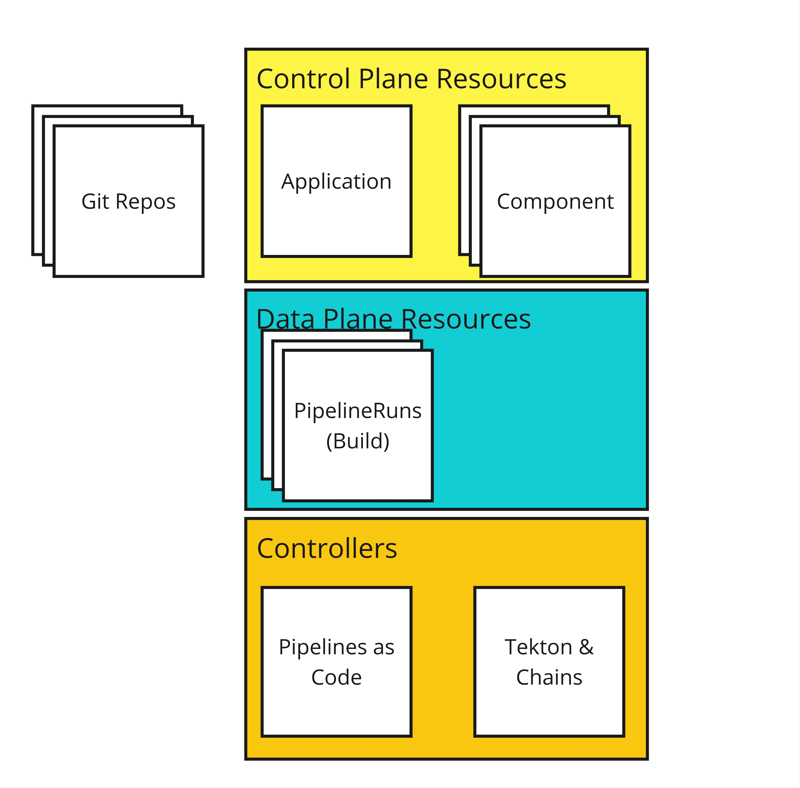
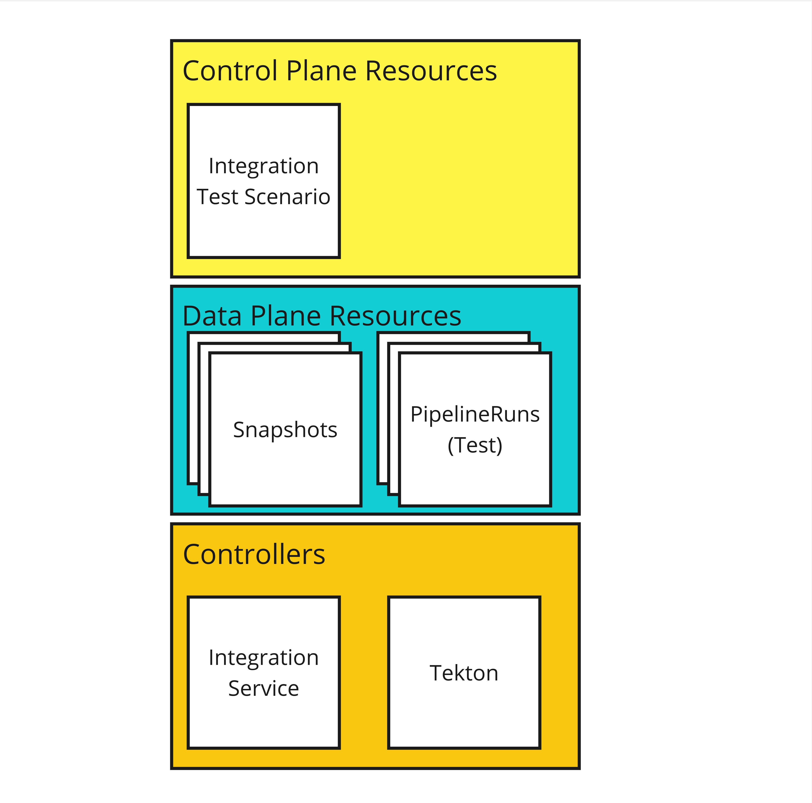

name: inverse
layout: true
class: center, middle, inverse, title
---
 

## Secure Builds Made Easy

.footnote[[konflux-ci.dev](https://konflux-ci.dev)]
---
layout: false
.left-column[
  ## What is it?
]
.right-column[
.large[
  Konflux is an opinionated, Kubernetes-native, security first software factory based on Tekton.
]

Our goals are to be able to:

⌬ Build software that consists of **multiple components, from multiple repositories**.

🕵 Provide **transparency on the software supply chain**, including both what makes up the software and how it was built.

✅ Help teams ensure their software **meets their own expectations** by providing functional integration test capabilities.

🤝 Provide a way for software teams to **release to destinations under the control other teams** with guarantees that it **meets  the destination teams' expectations**.

🌈 Tie all that together with a **unified user experience** across the entire build, test, and release process

]
---
.left-column[
  ## What is it?
  ## Why use it?
]
.right-column[

If any of the following statements sound like you:

- 🥴 You **don't have a secure build environment** today. ("Where do we even build?")

- 💸 You want to secure your build pipeline, but **don't know how or don't have the time**.
 
- 💀 You worry about the **provenance*** of your software builds.

- ⛓️ The build system you have today is **inflexible or difficult** to extend.

- 😕 You **get lost trying to follow the status** of artifacts on their way to release.

Then, Konflux might be the platform you.

.footnote[***provenance** means the origin, or the source of something]
]
---
.left-column[
  ## What is it?
  ## Why use it?
]
.right-column[

As the Konflux build pipelines are engineered with security in mind:

- Builds produced by Konflux build-tasks are certain to have **accurate source bill of materials (SBOMs)**.
- Build dependencies are fetched up front and the build is executed with **no network available**.

As Konflux is based on Tekton:

- Everything that happened during the build is recorded in a **signed, immutable log called an attestation**.
- This lets us write **machine-readable policy** which can be used at release time to determine if an artifact is acceptable.

As Konflux gates builds at release-time:

- Platform users can **develop new build strategies** in their production workspace to speed proofs of concept.
- Users get continuous feedback during their development cycle on pull requests, so there's **no surprises when it comes to release time**.

As Konflux is an integration of open source projects:

- Konflux is flexible in its own architecture and permits **different deployment configurations**.

]
---
.left-column[
  ## What is it?
  ## Why use it?
  ## Architecture
]
.right-column[

### Some notes on architecture

Our API server is **the kube API server**. Services are [controllers](https://kubernetes.io/docs/concepts/architecture/controller/) that expose their API as Custom Resource Definitions.

We **use tekton** for anything that should be extended by the user (building, testing, releasing).

The **user has admin** in their workspace. This means that the user can do lots of stuff - including access secrets in their workspace.

Artifacts are **OCI artifacts**. SBOMs, attestations, signatures, and other supporting metadata are stored in the registry too.

Any attestation used for making a release-time decision should be **provably trusted** (either because it is GPG signed or its immutable reference is added to the provenance by a trusted task).

It should be possible to **install** one subsystem without the others and to replace one subsystem with a new one without affecting the others. See [!148](https://github.com/redhat-appstudio/architecture/pull/148) for an example of attempting to achieve this.

]
---
.left-column[
  ## What is it?
  ## Why use it?
  ## Architecture
  ## APIs
  ## - Builds
]
.right-column[

]
---
.left-column[
  ## What is it?
  ## Why use it?
  ## Architecture
  ## APIs
  ## - Builds
  ## - Integration
]
.right-column[

]
---
.left-column[
  ## What is it?
  ## Why use it?
  ## Architecture
  ## APIs
  ## - Builds
  ## - Integration
  ## - Releases
]
.right-column[

]
---
name: last-page
template: inverse

## Let's look at the instance for Fedora

.large[
  [https://da.gd/konflux](https://da.gd/konflux)
]

Go to [https://da.gd/konflux](https://da.gd/konflux) for more notes.

---

name: inverse
layout: true
class: center, middle, inverse, title
---
 

## Thank you!

.footnote[[konflux-ci.dev](https://konflux-ci.dev)]
