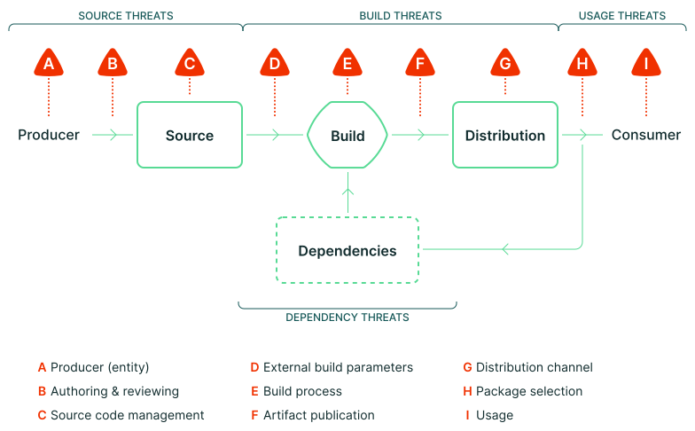

name: inverse
layout: true
class: center, middle, inverse, title
---

# Not just ticking a box ☑️ 

## Establishing trust in artifacts with provenance 🔐🔗

### Open Source Summit - North America 2025

Andrew McNamara • Red Hat

Ralph Bean • Red Hat

.footnote[🔗 slides: [ralphbean.github.io/slides/oss-na/2025/provenance.html](https://ralphbean.github.io/slides/oss-na/2025/provenance.html)]

---
layout: false
.left-column[
  ## Meatspace Analogy
]
.right-column[

## When you buy something physical...

- 📍 Where was it assembled?
- 🏭 Where did its parts come from?
- 🌱 Did it meet blah organic criteria?
- 👩‍🔬 Which quality inspector assessed it?
- 📜 What certifications does it have?

.large[
You get this information **stamped on packaging** or **included in the box**.
]

]

---
.left-column[
  ## Meatspace Analogy
  ## Software Reality
]
.right-column[

## When you consume a software artifact in production...

.large[
Do you know its **provenance**?
]

- 🏗️ Where is this artifact from?
- ⚙️ How was it produced?
- 🧪 What checks ran against it?
- 👤 Who claims these facts?
- 🔒 Can you trust those claims?

.large[
We generally don't get this with software today.
]

]

---
layout: false
.left-column[
  ## Meatspace Analogy
  ## Software Reality
  ## What is Provenance?
]
.right-column[

## What is provenance?

For software artifacts (containers, packages, binaries):

- 📂 **Source**: What sources were provided to the build?
- 🔄 **Transformation**: What steps were applied before the build?
- 🏗️ **Build Process**: How was it built? Where? When?
- 🛡️ **Post-Build**: What happened to the artifact after that?
- ✅ **Verification**: What checks were performed?

.foonote[
Generally, **provenance** is the **origin** of something.
]

]

---
.left-column[
  ## Meatspace Analogy
  ## Software Reality
  ## What is Provenance?
  ## Threats
]
.right-column[



.footnote[*from the "Supply-chain Levels for Software Artifacts" (SLSA) docs!]

]

---
.left-column[
  ## Meatspace Analogy
  ## Software Reality
  ## What is Provenance?
  ## Threats
  ## Traditional Signing
]
.right-column[

## Traditional Software Signing is Limited

```
gpg --verify artifact.tar.gz.sig artifact.tar.gz
```

✅ **Identity**: Who signed this?  
❓ **Context**: What were they claiming when they signed it?

.large[
A signature just means **"it's good"** 

But good **how**? Good **why**?
]

]

---
template: inverse

# 📋 Enter: Attestations

---
layout: false
.left-column[
  ## Attestations
]
.right-column[

## in-toto Attestation Framework

.large[
An attestation is an **"I solemnly swear..."** statement
]

- 👤 **Who**: Identity making the claim (signed)
- 🔐 **Verification**: Cryptographically verifiable
- 📦 **What**: The artifact being described
- 📝 **Statement**: The specific claim being made

Instead of just "it's signed" → **"here's exactly what happened"**

]

---
layout: false
.left-column[
  ## Attestations
  ## sigstore & cosign
]
.right-column[

## cosign from the sigstore project

```
$ echo '{"hello": "world"}' > predicate.json

$ cosign attest \
    --type custom \
    --predicate predicate.json \
    quay.io/rbean/test:oss-na

$ cosign verify-attestation \
    --certificate-identity ralph.bean@gmail.com \
    --certificate-oidc-issuer https://github.com/login/oauth \
    quay.io/rbean/test:oss-na \
        | jq '.payload | @base64d | fromjson'
```

]
---
layout: false
.left-column[
  ## Attestations
  ## sigstore & cosign
  ## systems
]
.right-column[

## Compare systems that produce provenance

| | 🐙 GitHub | 🦉 Witness | 🐱 Tekton |
| --- | --- | --- | --- |
| Source     | ✅ Detailed  | ✅ Detailed | ✅ Detailed |
| Parameters | ✅ Detailed  | ✅ Detailed | ✅ Detailed |
| Materials  | ❓ Unclear   | ✅ Detailed | ✅ Detailed |
| Signature  | ❓ In build  | ❓ In build | ⚠️ External  |

]

---
template: inverse

# 🏗️ Konflux: Our Project

---
layout: false
.left-column[
  ## Konflux
]
.right-column[

## : Secure Software Factory 

.large[
**Open source**, **cloud native** software factory focused on **supply chain security**.
]

- 🏗️ **Comprehensive**: Build → Test → Release pipeline
- 🛡️ **Security-first**: Attestations throughout the process
- 📊 **Policy-driven**: Machine-readable policies gate releases
- 📋 **SBOM**: Novel manifest generation with "Hermeto".

.footnote[
**Each step creates verifiable evidence**
]

]


---
layout: false
.left-column[
  ## Konflux
  ## Doing Stuff
]
.right-column[

## Stuff you can do

### 📊 **Compliance & Auditing**  
- Prove security practices were followed
- Generate audit reports automatically

### 🔍 **Incident Response**
- Trace back to root cause
- Understand blast radius

### 🧬 **Evolve Posture**
- Block artifacts out of compliance
- Encode schedules in the policies
- Vary policies by target

]

---
.left-column[
  ## Konflux
  ## Doing Stuff
  ## Policy Gates
]
.right-column[

## conforma: Policy-Based Gating

```rego
deny contains result if {
  some required_task in _missing_tasks(current_required_tasks.tasks)

  # Don't report an error if a task is required now, but not in the future
  required_task in latest_required_tasks.tasks
  result := lib.result_helper_with_term(
    rego.metadata.chain(),
    [_format_missing(required_task, false)],
    required_task
  )
}
```

**Machine-readable policies** decide what gets released.

]

---
.left-column[
  ## Konflux
  ## Doing Stuff
  ## Policy Gates
  ## Innovation (last slide)
]
.right-column[

## Enabling Safe Innovation

.large[
**One way**: Make insecure things impossible
]

- 🐢 Innovation is slow
- 🤷 Change gatekeepers may not understand needs  
- 🏃‍♀️ Devs circumvent restrictions, defeating the purpose

.large[
**Another way**: Define what "good" looks like
]

- ✅ Clear requirements for release
- 🧪 Freedom to experiment in development
- 🚀 Fast feedback loop
- 👥 Democratize contributions

]

---
template: inverse

# konflux is kool

### Monday, June 23 (cdCon)
Lock the Chef in the Kitchen: Enabling Accurate SBOMs Via Hermetic Builds
### Wednesday, June 24 (cdCon)
Who Are You Building For: Pipelines Have a Purpose
### Wednesday, June 25 (OpenGovCon)
Building Trust Through Proactive Security - Key Parts of the Trusted Software Supply Chain
### Thursday, June 26 (OpenSSF Community Day)
Who Are You Building For: Pipelines Have a Purpose

---
template: inverse

# Ok.

---
name: last-page
template: inverse

## 🔗 Resources & Questions

**Blog**: [How we use software provenance at Red Hat](https://developers.redhat.com/articles/2025/05/15/how-we-use-software-provenance-red-hat)

**sigstore project**: [sigstore.dev](https://www.sigstore.dev/)

**in-toto Attestations**: [in-toto.io](https://in-toto.io)

**SLSA Framework**: [slsa.dev](https://slsa.dev)

**Conforma**: [conforma.dev](https://conforma.dev)

**Try Konflux**: [konflux-ci.dev](https://konflux-ci.dev)

**slides**: [ralphbean.github.io/slides/oss-na/2025/provenance.html](https://ralphbean.github.io/slides/oss-na/2025/provenance.html)

---

name: inverse
layout: true
class: center, middle, inverse, title
---

# Thanks!

.footnote[Andrew McNamara • Ralph Bean]
---

# Appendix

---
layout: false
.left-column[
  ## GitHub
]
.right-column[

## GitHub Actions Provenance

```yaml
jobs:
  build:
    steps:
      - uses: actions/checkout@v4
      - name: Build
        run: make build
      - uses: actions/attest-build-provenance@v1
        with:
          subject-path: './dist/app'
```

✅ **Source**: Commit SHA, repo URL  
✅ **Workflow**: Workflow file, inputs   
❓ **Materials**: Which actions?  
❓ **Data plane**: Signature happens in the workflow

]
---
layout: false
.left-column[
  ## GitHub
]
.right-column[

## GitHub Actions Provenance

If there's network, show:

```
IMAGE=quay.io/lucarval/festoji@sha256:b508f3da1ba56f258d72da91c8ce07950ced85f142d81974022f61211c4a445a
oras blob fetch "$IMAGE" --output - | \
    jq '.dsseEnvelope.payload | @base64d | fromjson '
```

✅ **Source**: Commit SHA, repo URL  
✅ **Workflow**: Workflow file, inputs  
❓ **Materials**: Which actions?  
❓ **Data plane**: Signature happens in the workflow

]

---
.left-column[
  ## GitHub
  ## Witness
]
.right-column[

## Witness Framework

```bash
witness run -s build -- make build
witness run -s test -- make test  
witness run -s deploy -- kubectl apply -f app.yaml
```

✅ **Source**: Commit SHA, repo URL   
✅ **Detailed task execution**: How was it called  
✅ **Detailed materials**: What was used  
❓ **Data plane**: Signature happens in the workflow

]

.footnote[or with a GitHub Action: https://github.com/testifysec/witness-demo]
---
.left-column[
  ## GitHub
  ## Witness
]
.right-column[

## Witness Provenance

If there's network, show:

```
IMAGE=quay.io/bootc-devel/fedora-bootc-rawhide-standard:20250605-110837
cosign download attestation $IMAGE  2> /dev/null | \
    jq '.payload | @base64d | fromjson '
```

✅ **Source**: Commit SHA, repo URL   
✅ **Detailed task execution**: How was it called  
✅ **Detailed materials**: What was used  
❓ **Data plane**: Signature happens in the workflow

]

---
.left-column[
  ## GitHub
  ## Witness
  ## Tekton
]
.right-column[

## Tekton Chains Provenance

```yaml
apiVersion: tekton.dev/v1beta1
kind: TaskRun
metadata:
  annotations:
    chains.tekton.dev/signed: "true"
spec:
  taskRef:
    name: git-clone
  params:
    - name: url
      value: https://github.com/example/repo
```

✅ **Source**: Commit SHA, repo URL  
✅ **Detailed task execution**: How was it called  
✅ **Detailed materials**: What was used  
✅ **Control plane**: Payload doesn't sign itself  

]

---
.left-column[
  ## GitHub
  ## Witness
  ## Tekton
]
.right-column[

## Tekton Chains Provenance

If there's network, show:

```
IMAGE=quay.io/bootc-devel/fedora-bootc-rawhide-standard:20250605-110837
cosign download attestation $IMAGE  2> /dev/null | \
    jq '.payload | @base64d | fromjson '
```

✅ **Source**: Commit SHA, repo URL  
✅ **Detailed task execution**: How was it called  
✅ **Detailed materials**: What was used  
✅ **Control plane**: Payload doesn't sign itself  

]
