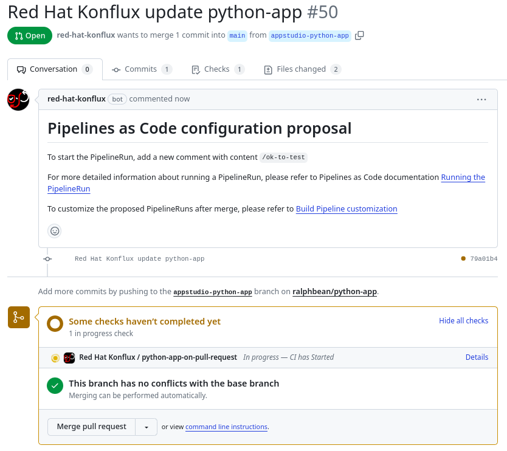

name: inverse
layout: true
class: center, middle, inverse, title
---
<br/>

## Secure Builds Made Easy

.footnote[[konflux-ci.dev](https://konflux-ci.dev)]
---
layout: false
.left-column[
  ## What is it?
]
.right-column[
.large[
  Konflux is an opinionated, Kubernetes-native, security first software factory based on Tekton.
]

Our goals are to be able to:

Compose software that consists of **multiple components, from multiple repositories**.

Provide **transparency on the software supply chain**, including both what makes up the software and how it was built.

Provide a way for software teams to **release to destinations under the control other teams** (like SRE or release engineering teams).

Provide a **unified user experience** across the entire build, test, and release process

]
---
.left-column[
  ## What is it?
  ## Why use it?
]
.right-column[

If any of the following statements sound like you:

- You don't have a secure build environment today. Where do we even build?
 
- You worry about the **provenance** of your software builds.

- The build system you have today is **inflexible or difficult** to extend.

- You **get lost trying to follow the status** of artifacts on their way to release.

Then, Konflux might be the platform your team.
]
---
.left-column[
  ## What is it?
  ## Why use it?
]
.right-column[

As the Konflux build pipelines are engineered with security in mind:

- Builds produced by Konflux build-tasks are certain to have **accurate manifests**.
- Build dependencies are fetched up front and the build is executed with **no network available**.

As Konflux is based on Tekton:

- It provides **cryptographic attestation** about the provenance of the build, recorded as [in-toto](https://github.com/in-toto/attestation) attestations.
- This lets us write **machine-readable policy** which can be used at release time to determine if an artifact is acceptable.

As Konflux gates builds at release-time:

- Platform users can **develop new build strategies** in their production workspace to speed proofs of concept.

As Konflux is an integration of open source projects:

- Konflux must be flexible in its own architecture to permit **different deployment configurations**.

]
---
template: inverse

## What is the flow like, then?
---
name: how

.left-column[
  ## The Process
  ### - Build
]
.right-column[

Assume that your team has already used [the installer](https://github.com/konflux-ci/konflux-ci?tab=readme-ov-file#konflux-ci) to set up an instance or that somebody else is running an instance for you.

In the UI, you click, click..

TODO - Screenshot goes here.

Under the hood, the system has recorded an `Application` resource that represents a coherent set of Components that should be built, tested, and released together. It recorded a `Component` too, that represents the git branch on the git repository that should be used to build OCI artifacts from commits that appear there.
]
---
When you create the component, Konflux will send a **pull request** to your repo with the pipeline definition in a `.tekton/` directory.


---

```remark
apiVersion: tekton.dev/v1
kind: PipelineRun
spec:
  pipelineSpec:
    tasks:
    - name: build-container
      taskRef:
        params:
        - name: name
          value: buildah
        - name: bundle
          value: "quay.io/redhat-appstudio-tekton-catalog/task-buildah:0.1"
        - name: kind
          value: task
        resolver: bundles
      runAfter:
      - prefetch-dependencies
      workspaces:
      - name: source
        workspace: workspace
```

---

---
.left-column[
  ## The Process
  ### - Build
]
.right-column[

The pull request itself initiates a build in Konflux.


]
---
.left-column[
  ## The Process
  ### - Build
  ### - Test
]
.right-column[

You register integration tests with the system that should be executed against all of the components in your application in response to new builds.

TODO - example of a integration test calling out to testing farm

]
---
name: last-page
template: inverse

## Thanks!
