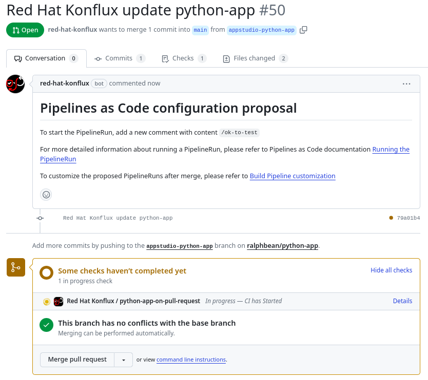

name: inverse
layout: true
class: center, middle, inverse, title
---
<br/>

## Secure Builds Made Easy

.footnote[[konflux-ci.dev](https://konflux-ci.dev)]
---
template: inverse

# Continuous Delivery

---
layout: false
.left-column[
  ## Continuous Delivery
]
.right-column[

### Remind me why, again?

Continuous delivery..

- 🔬 enables us to collect user data we need from an MVP 

- ⏱️ reduces time required to fix CVEs and bugs

- 🧠 allows us to work on smaller chunks of work at a time

- 🧪 makes it easier to run experiments with live users (like A / B testing)
]

---
.left-column[
  ## Continuous Delivery
  ## Practice makes Perfect
]
.right-column[

### When you want to get good at something…

By practicing continuous delivery, we can become proficient at releasing software.

Being good at delivery means it is:

- 👻 less scary

- 🌉 more reliable

- ☀️  releases happen during business hours

- 🛠️ fix problems faster because it takes less time to get a release out

- 🔎 every release is smaller so it is easier to find out what went wrong with a release

.footnote[So why is it so elusive?]
]

---
.left-column[
  ## Continuous Delivery
  ## Practice makes Perfect
  ## Human Problems
]
.right-column[

.large[
The **technology problem** here isn't that complicated..
]

..but enabling one team at the expense of another creates an unsustainable situation.

**Equilibrium** needs to be reached. We need to build a healthy relationship with our colleagues, understand what each party needs and build a system that respects those needs.

.footnote[TBH Brian, I don't understand this slide if you're not speaking over it. Let's rephrase to explain why anybody's team is at a loss]

]

---
.left-column[
  ## Continuous Delivery
  ## Practice makes Perfect
  ## Human Problems
  ## Dramatis Personae
]
.right-column[

### Who is involved?

**Developers**: want to be efficient, use modern technologies, be free to
experiment and evolve over time.  Desire minimum toil / overhead 

**Operations**: want to enforce principle of least privilege, protect
infrastructure from misconfiguration

**Security & compliance**: want to ensure mandated SDL and regulatory practices
are followed, CVEs are fixed and threats from bad actors are mitigated

]

---
.left-column[
  ## Continuous Delivery
  ## Practice makes Perfect
  ## Human Problems
  ## Dramatis Personae
  ## Rigidity
]
.right-column[

## The problem with rigid build systems

(or, what happens when security is enabled at at the expense of developers)

- 🐢 Innovation is slow because there are relatively few people who can make changes

- 🤷 The people who can make the changes may not know how to make the desired changes

- 👀 Early stage projects & prototypes start to use other systems to circumvent restrictions 

- 🏃‍♀️Eventually 'shadow' systems form where users flee to escape their oppression

]

---
.left-column[
  ## Continuous Delivery
  ## Practice makes Perfect
  ## Human Problems
  ## Dramatis Personae
  ## Rigidity
  ## What if?
]
.right-column[

## What if the production build system could be both flexible and secure?

What if you could...

- Define the characteristics that make an artifact acceptable

- Prevent any artifact which does meet those policy requirements from being released.

- Give users the power to change their build processes in any way they like.

What if you could **give users the freedom to experiment** but clearly message what is necessary in order to release an artifact. **Block releases that don't meet the requirements**.

.footnote[
This is the basis for equilibrium.
TODO - but, "equilibrium"?
]

]

---
.left-column[
  ## Continuous Delivery
  ## Practice makes Perfect
  ## Human Problems
  ## Dramatis Personae
  ## Rigidity
  ## What if?
  ## Virtuous Cycle
]
.right-column[

## If you could do that, you'd unlock innovation

When anything is possible people can innovate.

New build automation likely produces 'bad' builds, but can evolve to become 'good' builds with feedback and hardening.

This is **safe & open innovation** in the CD system.

New capabilities in the productization system follow a pattern:

.large[
**try ➜ demo ➜ harden ➜ adopt**
]

]

---
template: inverse

Let me tell you about...

<br/>

---
layout: false
.left-column[
  ## What is it?
]
.right-column[
.large[
  Konflux is an opinionated, Kubernetes-native, security first software factory based on Tekton.
]

Our goals are to be able to:

⌬ Compose software that consists of **multiple components, from multiple repositories**.

🕵 Provide **transparency on the software supply chain**, including both what makes up the software and how it was built.

🤝 Provide a way for software teams to **release to destinations under the control other teams** with minimal friction (teams like SRE or release engineering teams).

🌈 Provide a **unified user experience** across the entire build, test, and release process

]
---
.left-column[
  ## What is it?
  ## Why use it?
]
.right-column[

If any of the following statements sound like you:

- 🥴 You **don't have a secure build environment** today. ("Where do we even build?")

- 💸 You want to secure your build pipeline, but **don't know how or don't have the time**.
 
- 💀 You worry about the **provenance** of your software builds.

- ⛓️ The build system you have today is **inflexible or difficult** to extend.

- 😕 You **get lost trying to follow the status** of artifacts on their way to release.

Then, Konflux might be the platform your team.
]
---
.left-column[
  ## What is it?
  ## Why use it?
]
.right-column[

As the Konflux build pipelines are engineered with security in mind:

- Builds produced by Konflux build-tasks are certain to have **accurate manifests**.
- Build dependencies are fetched up front and the build is executed with **no network available**.

As Konflux is based on Tekton:

- It provides **cryptographic attestation** about the provenance of the build, recorded as [in-toto](https://github.com/in-toto/attestation) attestations.
- This lets us write **machine-readable policy** which can be used at release time to determine if an artifact is acceptable.

As Konflux gates builds at release-time:

- Platform users can **develop new build strategies** in their production workspace to speed proofs of concept.

As Konflux is an integration of open source projects:

- Konflux is flexible in its own architecture and permits **different deployment configurations**.

]
---
.left-column[
  ## What is it?
  ## Why use it?
  ## Architecture
]
.right-column[

At a glance, the system looks like:

TODO - diagram

Some notes about the deployment, sharding, scaling, resilience, APIs, RBAC, etc.

]
---
---
template: inverse

## How do you use it?
---
name: how

.left-column[
  ## Flow
  ### - Build
]
.right-column[

Assume that your team has already used [the installer](https://github.com/konflux-ci/konflux-ci?tab=readme-ov-file#konflux-ci) to set up an instance or that somebody else is running an instance for you.

In the UI, you click, click..

TODO - Screenshot goes here.

Under the hood, the system has recorded an `Application` resource that represents a coherent set of Components that should be built, tested, and released together. It recorded a `Component` too, that represents the git branch on the git repository that should be used to build OCI artifacts from commits that appear there.
]
---
When you create the component, Konflux will send a **pull request** to your repo with the pipeline definition in a `.tekton/` directory.


---

```remark
apiVersion: tekton.dev/v1
kind: PipelineRun
spec:
  pipelineSpec:
    tasks:
    - name: build-container
      taskRef:
        params:
        - name: name
          value: buildah
        - name: bundle
          value: "quay.io/redhat-appstudio-tekton-catalog/task-buildah:0.1"
        - name: kind
          value: task
        resolver: bundles
      runAfter:
      - prefetch-dependencies
      workspaces:
      - name: source
        workspace: workspace
```

---

---
.left-column[
  ## The Process
  ### - Build
]
.right-column[

The pull request itself initiates a build in Konflux.


]
---
.left-column[
  ## The Process
  ### - Build
  ### - Test
]
.right-column[

You register integration tests with the system that should be executed against all of the components in your application in response to new builds.

TODO - example of a integration test calling out to testing farm

]
---
name: last-page
template: inverse

## Thanks!
