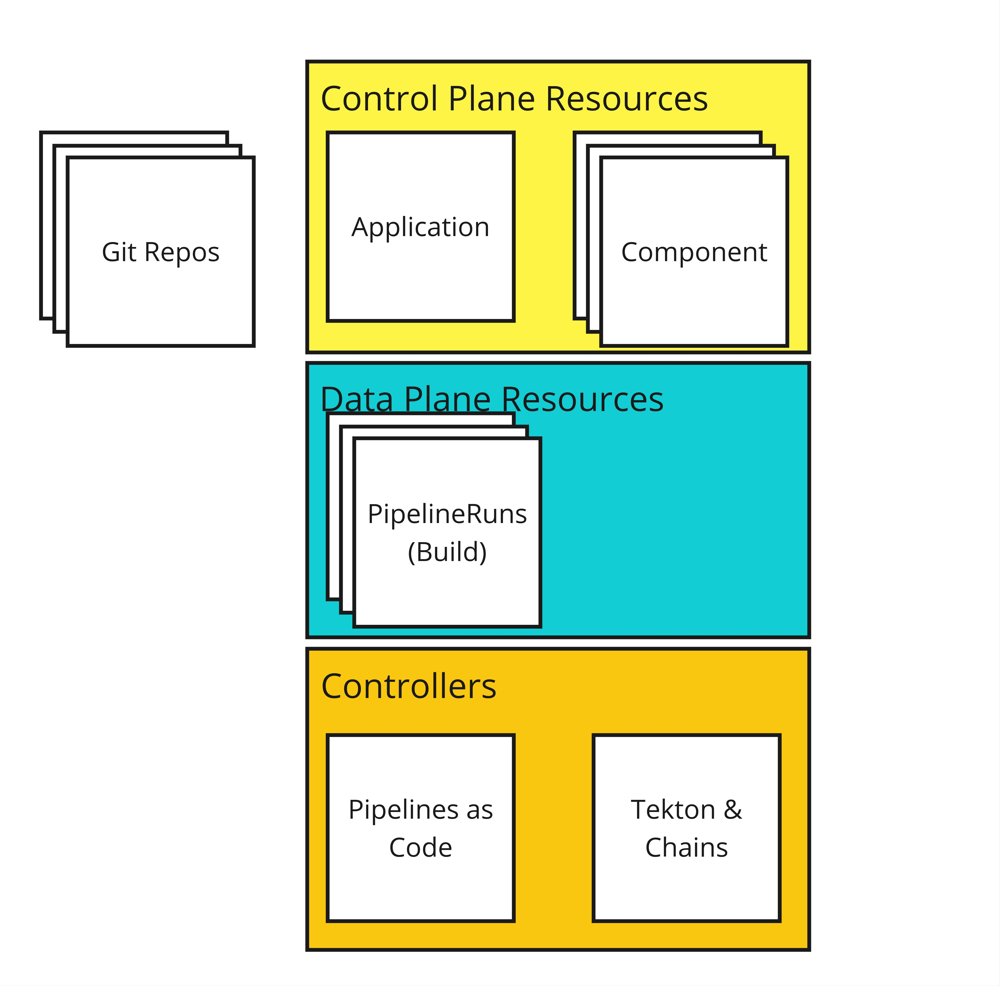
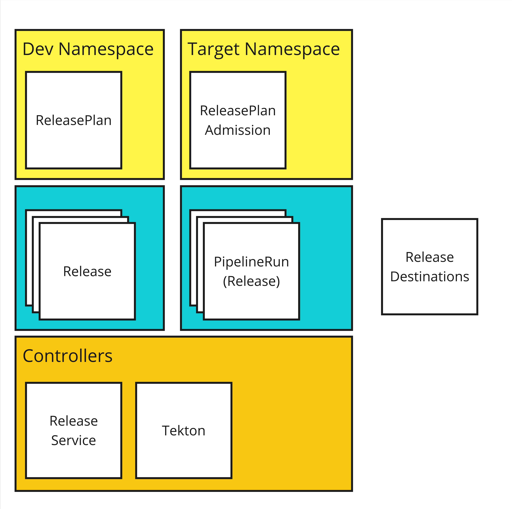

name: inverse
layout: true
class: center, middle, inverse, title
---
 

## Secure Builds Made Easy

.footnote[[konflux-ci.dev](https://konflux-ci.dev)]
---
template: inverse

# Continuous Delivery

---
layout: false
.left-column[
  ## Continuous Delivery
]
.right-column[

### Remind me why, again?

Continuous delivery..

- 🔬 enables us to collect user data we need from an MVP 

- ⏱️ reduces time required to fix CVEs and bugs

- 🧠 allows us to work on smaller chunks of work at a time

- 🧪 makes it easier to run experiments with live users (like A / B testing)
]

---
.left-column[
  ## Continuous Delivery
  ## Practice makes Perfect
]
.right-column[

### When you want to get good at something…

By practicing continuous delivery, we can become proficient at releasing software.

Being good at delivery means it is:

- 👻 less scary

- 🌉 more reliable

- ☀️  releases happen during business hours

- 🛠️ fix problems faster because it takes less time to get a release out

- 🔎 every release is smaller so it is easier to find out what went wrong with a release

.footnote[So why is it so elusive?]
]

---
.left-column[
  ## Continuous Delivery
  ## Practice makes Perfect
  ## Human Problems
]
.right-column[

.large[
The **technology problem** here isn't that complicated..
]

..but enabling one team at the expense of another creates an unstable situation.

**Equilibrium** needs to be reached. We need to build a healthy relationship with our colleagues, understand what each party needs and build a system that respects those needs.

Who is involved?

**Developers**: want to be efficient, use modern technologies, be free to
experiment and evolve over time.  Desire minimum toil / overhead 

**Operations**: want to enforce principle of least privilege, protect
infrastructure from misconfiguration

**Security & compliance**: want to ensure mandated SDL and regulatory practices
are followed, CVEs are fixed and threats from bad actors are mitigated

]

---
.left-column[
  ## Continuous Delivery
  ## Practice makes Perfect
  ## Human Problems
  ## Rigidity
]
.right-column[

## The problem with rigid build systems

How did we prioritize security and compliance?

By **making insecure things impossible**.

- 🐢 Innovation is slow because there are relatively few people who can make changes

- 🤷 The people who can make the changes may not know how to make the desired changes

- 👀 Early stage projects & prototypes start to use other systems to circumvent restrictions 

- 🏃‍♀️Eventually 'shadow' systems form where users flee to escape their oppression

]

---
.left-column[
  ## Continuous Delivery
  ## Practice makes Perfect
  ## Human Problems
  ## Rigidity
  ## What if?
]
.right-column[

## What if the production build system could be both flexible and secure?

What if you could...

- Define the characteristics that make an artifact acceptable

- Prevent any artifact which does meet those policy requirements from being released.

- Give users the power to change their build processes in any way they like.

What if you could **give users the freedom to experiment** but clearly message what is necessary in order to release an artifact.

**Block releases that don't meet the requirements**.

]

---
.left-column[
  ## Continuous Delivery
  ## Practice makes Perfect
  ## Human Problems
  ## Rigidity
  ## What if?
  ## Virtuous Cycle
]
.right-column[

## If you could do that, you'd unlock innovation

When anything is possible people can innovate.

New build automation likely produces 'bad' builds, but can evolve to become 'good' builds with feedback and hardening.

This is **safe & open innovation** in the CD system.

New capabilities in the productization system follow a pattern:

.large[
**try ➜ demo ➜ harden ➜ adopt**
]

]

---
template: inverse

Let me tell you about...

 

---
layout: false
.left-column[
  ## What is it?
]
.right-column[
.large[
  Konflux is an opinionated, Kubernetes-native, security first software factory based on Tekton.
]

Our goals are to be able to:

⌬ Build software that consists of **multiple components, from multiple repositories**.

🕵 Provide **transparency on the software supply chain**, including both what makes up the software and how it was built.

✅ Help teams ensure their software **meets their own expectations** by providing functional integration test capabilities.

🤝 Provide a way for software teams to **release to destinations under the control other teams** with guarantees that it **meets  the destination teams' expectations**.

🌈 Tie all that together with a **unified user experience** across the entire build, test, and release process

And above all, minimize friction.
]
---
.left-column[
  ## What is it?
  ## Why use it?
]
.right-column[

If any of the following statements sound like you:

- 🥴 You **don't have a secure build environment** today. ("Where do we even build?")

- 💸 You want to secure your build pipeline, but **don't know how or don't have the time**.
 
- 💀 You worry about the **provenance*** of your software builds.

- ⛓️ The build system you have today is **inflexible or difficult** to extend.

- 😕 You **get lost trying to follow the status** of artifacts on their way to release.

Then, Konflux might be the platform your team.

.footnote[***provenance** means the origin, or the source of something]
]
---
.left-column[
  ## What is it?
  ## Why use it?
]
.right-column[

As the Konflux build pipelines are engineered with security in mind:

- Builds produced by Konflux build-tasks are certain to have **accurate source bill of materials (SBOMs)**.
- Build dependencies are fetched up front and the build is executed with **no network available**.

As Konflux is based on Tekton:

- Everything that happened during the build is recorded in a **signed, immutable log called an attestation**.
- This lets us write **machine-readable policy** which can be used at release time to determine if an artifact is acceptable.

As Konflux gates builds at release-time:

- Platform users can **develop new build strategies** in their production workspace to speed proofs of concept.
- Users get continuous feedback during their development cycle on pull requests, so there's **no surprises when it comes to release time**.

As Konflux is an integration of open source projects:

- Konflux is flexible in its own architecture and permits **different deployment configurations**.

]
---
.left-column[
  ## What is it?
  ## Why use it?
  ## APIs
  ## - Builds
]
.right-column[

]
---
.left-column[
  ## What is it?
  ## Why use it?
  ## APIs
  ## - Builds
  ## - Integration
]
.right-column[

]
---
.left-column[
  ## What is it?
  ## Why use it?
  ## APIs
  ## - Builds
  ## - Integration
  ## - Releases
]
.right-column[

]
---
name: last-page
template: inverse

## Questions?

We could only scratch the surface - there's so much more to talk about.

If you want to try to set up Konflux locally, try our installer instructions at [https://github.com/konflux-ci/konflux-ci](https://github.com/konflux-ci/konflux-ci).

If you want to start a discussion, open a github issue under [konflux-ci/discussions](https://github.com/konflux-ci/discussions)

---

name: inverse
layout: true
class: center, middle, inverse, title
---
 

## Thank you!

.footnote[[konflux-ci.dev](https://konflux-ci.dev)]
